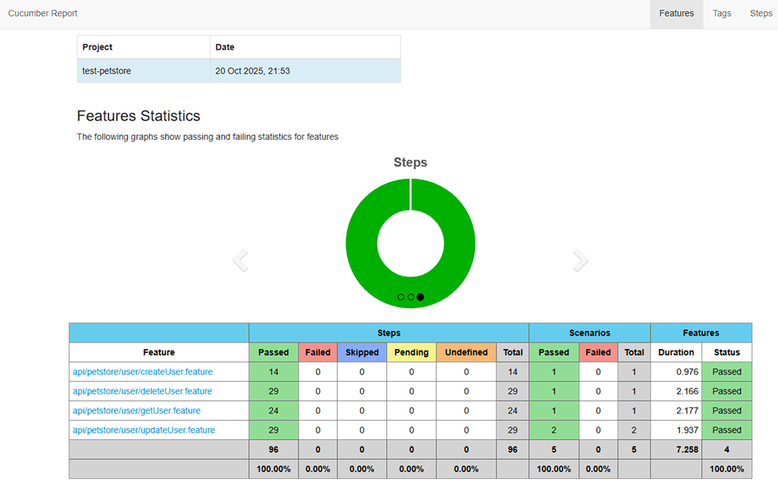

# ✍️ Conclusiones del Ejercicio de Pruebas: PetStore - Módulo de Usuarios

## 📊 Resumen Ejecutivo de Pruebas Automatizadas

Este ciclo de pruebas se enfocó en la validación de la capa de servicio (API) para el flujo CRUD (Crear, Leer,
Actualizar, Eliminar) del recurso de usuarios. Se ejecutaron 5 escenarios principales para verificar la integridad y el
comportamiento esperado de los endpoints.

| Métrica                            | Valor       |
|:-----------------------------------|:------------|
| **Total de Escenarios Ejecutados** | 5           |
| **Escenarios Exitosos (Pass)**     | 5           |
| **Escenarios Fallidos (Fail)**     | 0           |
| **Porcentaje de Éxito**            | 100.0%      |
| **Tiempo Total de Ejecución**      | 07 segundos |

---

## 🔍 Hallazgos de Pruebas

Se identificaron problemas críticos relacionados con la unicidad de datos y el comportamiento de los endpoints de
actualización.

🔴 Bugs Críticos

| ID        | Endpoint             | Descripción del Hallazgo                                                                                                                                                                                                                                                                                                             |
|:----------|:---------------------|:-------------------------------------------------------------------------------------------------------------------------------------------------------------------------------------------------------------------------------------------------------------------------------------------------------------------------------------|
| API-C-001 | POST /user/          | Violación de Unicidad: El endpoint no implementa ninguna validación de unicidad para campos clave. Permite la creación de nuevos registros con id, username y/o email que ya están registrados en el sistema. Esto puede llevar a corrupción de datos y registros duplicados.                                                        |
| API-C-002 | GET /user/{username} | Problema de Latencia/Caché: Después de actualizar un usuario (PUT), la consulta inmediata a este endpoint devuelve los valores antiguos durante unos segundos. Esto indica un problema de latencia en la sincronización de la base de datos o un cache no invalidado correctamente, afectando la percepción de datos en tiempo real. |

🟠 Hallazgos Mayores

| ID        | Endpoint             | Descripción del Hallazgo                                                                                                                                                                                                                                       |
|:----------|:---------------------|:---------------------------------------------------------------------------------------------------------------------------------------------------------------------------------------------------------------------------------------------------------------|
| API-M-001 | PUT /user/{username} | Comportamiento de Creación Inesperado: Si se omite el campo id en el cuerpo de la petición, el endpoint crea un nuevo registro en lugar de actualizar el usuario especificado en la URL. Esto viola el principio de idempotencia esperado de la operación PUT. |
| API-M-002 | PUT /user/{username} | Requisito de Cuerpo Completo: El endpoint exige que se envíen todos los atributos del usuario en el cuerpo de la petición. No permite actualizaciones parciales (comportamiento de PATCH), lo cual incrementa la complejidad de la lógica de actualización.    |

## 💻 Conclusiones y Recomendaciones

### Conclusiones de Estabilidad

Los 5 escenarios de prueba confirman que el flujo CRUD básico es funcional; sin embargo, los mecanismos de seguridad y validación de datos (unicidad), junto con la consistencia de datos (latencia), presentan fallos críticos.

### Recomendaciones QA para el Desarrollo

1. **Priorizar Validación de Unicidad (API-C-001):** Implementar validaciones a nivel de base de datos y de aplicación para rechazar inmediatamente cualquier intento de crear usuarios con id, username o email duplicados.
2. **Investigar Latencia (API-C-002):** El equipo de DevOps/Backend debe investigar la causa del retraso en la obtención de datos post-modificación. Se sugiere validar la configuración de caché o la velocidad de réplica de la base de datos.
3. **Corregir el PUT Inesperado (API-M-001 y API-M-002):** 
    * Asegurar que PUT /user/{username} nunca cree un nuevo recurso si el usuario ya existe. 
    * Evaluar la implementación de un endpoint PATCH /user/{username} para permitir actualizaciones parciales, siguiendo las mejores prácticas REST.

## Screenshots

### Reporte Cucumber

